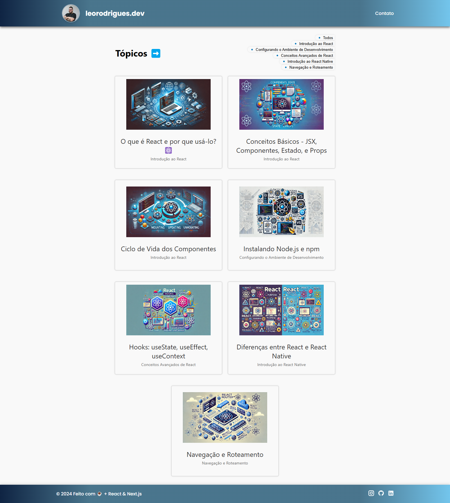

# leorodriguesdev-blog



<a href="https://blog-leorodriguesdev.vercel.app/">
<h1 align="center">
  Blog de Leonardo Rodrigues
</h1>
</a>
<p align="center">📝 Compartilhando conhecimentos sobre React, React Native, Node.js e Next.js</p>

---


<a href="https://nextjs.org/"></a>
<a href="https://github.com/leorodriguesdev/blog/issues"></a>
<a href="https://github.com/leorodriguesdev/blog/network"></a>
<a href="https://github.com/leorodriguesdev/blog/stargazers"></a>

## 📄 Sumário

- [Sobre](#sobre)
- [Status do Projeto](#status-do-projeto)
- [Features](#features)
- [Pré-requisitos](#pré-requisitos)
- [Instalação](#instalação)
- [Rodando a Aplicação](#rodando-a-aplicação)
- [Tecnologias](#tecnologias)
- [Autor](#autor)
- [📫 Contato](#-contato)
- [📜 Licença](#licença)

## 📝 Sobre

O **leorodriguesdev-blog** é um projeto de blog pessoal desenvolvido com [Next.js](https://nextjs.org/). Ele permite a criação e visualização de artigos sobre temas relacionados a React, React Native, Node.js e Next.js. Os conteúdos são armazenados em repositórios do GitHub e são buscados dinamicamente para renderização no site.

Este projeto visa compartilhar conhecimentos, tutoriais e experiências no desenvolvimento front-end e mobile, facilitando o aprendizado de novos desenvolvedores e entusiastas da área.

## 🚧 Status do Projeto

<h4 align="center"> 
	🚧  Blog em desenvolvimento... 🚧
</h4>

## ✅ Features

- [x] Listagem de artigos por categoria
- [x] Visualização de artigos com formatação de código
- [x] Navegação entre posts
- [x] Copiar trechos de código facilmente
- [ ] Sistema de comentários
- [ ] Página de login para autores


## 📋 Pré-requisitos

Antes de começar, você vai precisar ter instalado em sua máquina as seguintes ferramentas:

- [Git](https://git-scm.com)
- [Node.js](https://nodejs.org/en/) (versão 14 ou superior)
- [Yarn](https://yarnpkg.com/) ou [npm](https://www.npmjs.com/)

Além disso, é recomendado utilizar um editor de código como o [VSCode](https://code.visualstudio.com/).

## 🛠️ Instalação

Siga os passos abaixo para executar este projeto localmente:

1. **Clone este repositório:**

   ```bash
   git clone https://github.com/leorodriguesdev/blog.git
   ```

2. **Acesse a pasta do projeto no terminal/cmd:**

   ```bash
   cd leorodriguesdev-blog
   ```

3. **Instale as dependências:**

   ```bash
   yarn install
   ```

   ou

   ```bash
   npm install
   ```

4. **Configure as variáveis de ambiente:**

   Crie um arquivo `.env.local` na raiz do projeto e adicione sua chave de acesso ao GitHub:

   ```env
   GITHUB_TOKEN=seu_token_aqui
   ```

   > **Nota:** O `GITHUB_TOKEN` é necessário para acessar o conteúdo dos repositórios privados ou para aumentar os limites de requisições da API do GitHub.

## 🚀 Rodando a Aplicação

Após instalar as dependências e configurar as variáveis de ambiente, execute a aplicação em modo de desenvolvimento:

```bash
yarn dev
```

ou

```bash
npm run dev
```

A aplicação irá iniciar na porta `3000`. Acesse [http://localhost:3000](http://localhost:3000) no seu navegador para visualizar o projeto.

## 💻 Tecnologias

As seguintes ferramentas foram usadas na construção do projeto:

- [Next.js](https://nextjs.org/)
- [React](https://pt-br.reactjs.org/)
- [JavaScript (ES6+)](https://developer.mozilla.org/pt-BR/docs/Web/JavaScript)
- [TypeScript](https://www.typescriptlang.org/) *(opcional, se aplicável)*
- [Axios](https://axios-http.com/docs/intro)
- [MirageJS](https://miragejs.com/)
- [PrismJS](https://prismjs.com/)
- [Styled Components](https://styled-components.com/)
- [React Icons](https://react-icons.github.io/react-icons/)
- [Gray Matter](https://github.com/jonschlinkert/gray-matter)
- [Remark](https://remark.js.org/)
- [Rehype](https://rehype.js.org/)
- [Polished](https://polished.js.org/)
- [React Modal](https://reactcommunity.org/react-modal/)

## 👤 Autor

<a href="https://bio.link/leorodriguesdev">
 
 <br />
 <sub><b>Leonardo Rodrigues</b></sub></a> <a href="https://bio.link/leorodriguesdev" title="link leo">⚡</a>

Feito com ❤️ por Leonardo Rodrigues 👋🏽 Entre em contato!


## 📫 Contato

Desenvolvido por **Leonardo Rodrigues**.

- **LinkedIn:** [linkedin.com/in/leorodriguesdev](https://linkedin.com/in/leorodriguesdev)
- **Portfólio:** [leorodrigues.dev](https://www.leorodrigues.dev/)

---

## 📜 Licença

Este projeto está licenciado sob a licença [MIT](./LICENSE).

---

© 2025 Blog de Leonardo Rodrigues. Todos os direitos reservados.